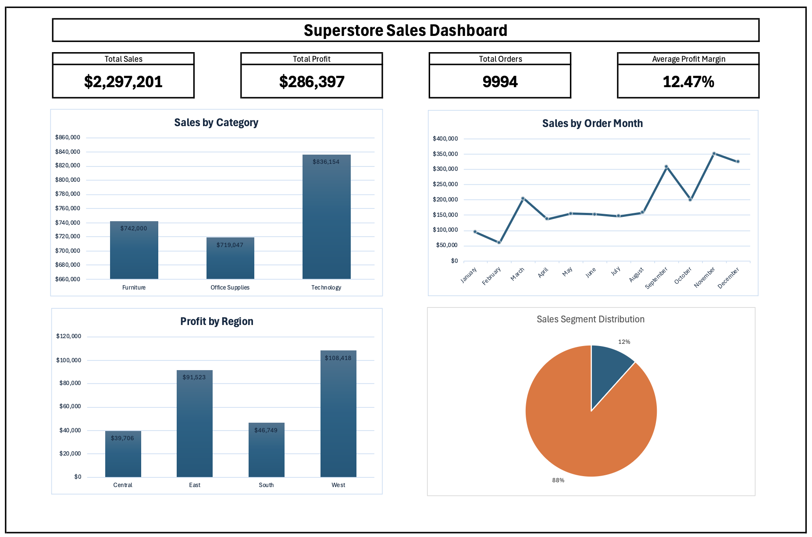

# Excel Business Analysis — Superstore Sales Dashboard

End-to-end business sales analysis project using Microsoft Excel featuring data cleaning, pivot table analysis, KPI reporting, and dashboard visualization based on the Sample Superstore dataset.

---

## Dashboard Preview



---

## Project Overview

This project analyzes retail sales performance using the Sample Superstore dataset. The analysis focuses on identifying sales trends, profitability, regional performance, customer segmentation, and discount impact through Excel-based business intelligence reporting.

The dashboard was built to simulate a real-world business sales reporting workflow commonly used in Data Analyst roles.

---

## Dataset

Dataset:
- Sample Superstore Dataset (.csv)

Main columns used:
- Order Date
- Sales
- Profit
- Discount
- Region
- Category
- Segment
- Quantity

Total Records:
- 9,994 rows

---

## Tools & Features Used

### Tools
- Microsoft Excel

### Features
- Pivot Tables
- Pivot Charts
- KPI Cards
- Dashboard Design
- Data Cleaning
- Helper Columns
- Conditional Formatting

### Excel Functions Used
```excel
IF()
TEXT()
YEAR()
SUM()
AVERAGE()
COUNT()
```

---

## KPI Summary

| KPI | Value |
|---|---|
| Total Sales | $2,297,201 |
| Total Profit | $286,397 |
| Total Orders | 9,994 |
| Average Profit Margin | 12.47% |

---

## Business Insights

Advanced retail operations and commercial performance insights extracted from the Superstore sales model (Total Portfolio: 9,994 orders yielding $2,297,201 in gross sales):

* **High-Volume Category Driver:** Technology stands out as the primary engine for top-line revenue generation across all product lines. This indicates a high market demand and premium basket-size contributions from electronics.
* **Regional Profit Engine:** The West region establishes itself as the clear leader in bottom-line performance, driving the highest overall net profitability due to optimized regional market penetration or local operating efficiencies.
* **Volume-Heavy Transactional Skew:** The consumer transaction profile is heavily concentrated within the Low-Sales Segment category, proving that the business relies on high-volume, low-ticket retail purchases rather than large enterprise contract structures.
* **Q4 Cyclical Demand Surges:** Commercial performance exhibits a strong seasonal acceleration during Q4 (September–December). This predictable holiday-driven surge underscores the necessity for aggressive pre-season inventory stacking and localized marketing allocation.
* **Discount-Induced Margin Erosion:** Promotional pricing strategies reveal a severe negative correlation with net profit. Uncapped discounting behavior directly eats into the baseline 12.47% average profit margin, turning high-volume velocity into net-negative operational leaks.

---

## Strategic Recommendations

Actionable, data-backed playbooks designed for Commercial Directors and Inventory Operations to safeguard gross margins and optimize capital allocation:

* **Enforce Programmatic Discount Guardrails:** Mitigate profit erosion by introducing automated margin caps on promotional structures. Transition from flat-rate discounts to volume-based rewards to protect the baseline 12.47% profit margin.
* **Scale Average Order Value (AOV) Thresholds:** Capitalize on the high density of the low-sales segment by implementing tactical cross-selling, threshold-based free shipping (Minimum Order Value), or bundle promotions to shift low-ticket shoppers into higher value cohorts.
* **Execute Pre-Q4 Demand Readiness Playbook:** Mitigate seasonal fulfillment risks by coordinating warehouse stock and capital deployment by late Q3 to maximize the predictable sales acceleration during the Q4 retail velocity window.
* **Reclaim Western Regional Efficiencies:** Audit the pricing mix, merchant relationships, and customer demographic profiles of the highly profitable West region to build a structural blueprint for underperforming territories.

---

## Potential Business Impact

* **Democratized Desktop Business Intelligence:** Transformed 9,994 rows of flat retail transactional records into an interactive, operational Excel dashboard—giving stakeholders zero-latency visibility into key metrics without requiring complex data infrastructure.
* **Surgical Gross Margin Protection:** Provided clear data evidence of discount-induced leaks, shifting corporate focus from blindly chasing top-line volume to actively optimizing net margin health across regions and product categories.


---

## Project Structure

```text
excel-business-analysis/
│
├── data/
│   ├── Sample-Superstore.csv
│   └── superstore-sales-dashboard.xlsx
│
├── dashboard/
│   ├── superstore-sales-dashboard.png
│   └── superstore-sales-dashboard.pdf
│
└── README.md
```

---

## Skills Demonstrated

- Data Cleaning in Excel
- Pivot Table Analysis
- Dashboard Development
- KPI Reporting
- Data Visualization
- Business Analysis
- Analytical Thinking

---

## Author

Ahmad Iqbal Maulana -  Data Analyst
